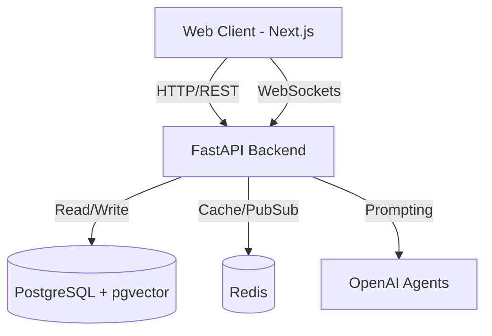

# MarketPulse v1 🚀

[](https://github.com/yourusername/marketpulse/actions)
[](https://opensource.org/licenses/MIT)
[](https://www.python.org/downloads/release/python-3110/)
[](https://nextjs.org/)

MarketPulse is an AI-powered financial intelligence and algorithmic trading platform. It provides institutional-grade research, real-time market simulation, and automated strategy execution in a modern, scalable architecture.

---

## 📸 Screenshots

*(Placeholders for future screenshots)*

| Dashboard Overview | AI Analyst & RAG | Strategy Builder |
|:---:|:---:|:---:|
|  |  |  |

---

## ✨ Key Features

- [x] **AI Financial Analyst:** Context-aware chat agent for financial inquiries.
- [x] **RAG Research Copilot:** Grounded SEC filing semantic search via pgvector.
- [x] **ML Stock Prediction:** Forecast trends using Random Forest, XGBoost, and LSTM models.
- [x] **Technical Indicators:** Compute RSI, MACD, and SMA dynamically.
- [x] **Sentiment Analysis:** FinBERT-driven news sentiment aggregation.
- [x] **Portfolio Management:** Track holdings, performance, and allocations.
- [x] **Strategy Builder:** Define algorithmic trading rules declaratively.
- [x] **Backtesting Engine:** Fast, vector-based historical simulation using `vectorbt`.
- [x] **Paper Trading Simulator:** Execute strategies against a real-time simulated market.
- [x] **Real-Time Market Streaming:** Low-latency WebSocket broadcasting for live prices.

---

## 🏗 Architecture Diagram



*(See [docs/ARCHITECTURE.md](docs/ARCHITECTURE.md) for deeper technical details).*

---

## 🛠 Technology Stack

* **Frontend:** Next.js, React, Tailwind CSS, Lucide Icons
* **Backend:** FastAPI, Python 3.11, SQLAlchemy, Alembic, WebSockets
* **Data & Cache:** PostgreSQL, pgvector, Redis
* **AI/ML:** OpenAI GPT-4o, text-embedding-3-large, scikit-learn, XGBoost, vectorbt
* **Deployment:** Docker, Docker Compose, GitHub Actions

---

## 🚀 Setup Instructions

1. **Clone the repository:**
   ```bash
   git clone https://github.com/yourusername/marketpulse.git
   cd marketpulse
   ```

2. **Configure Environment:**
   Copy the example environment file and fill in your keys.
   ```bash
   cp .env.example .env
   ```

3. **Start the Platform:**
   Use Docker Compose to spin up the entire stack.
   ```bash
   docker-compose up --build
   ```

4. **Access the Application:**
   * Frontend: http://localhost:3000
   * API Docs: http://localhost:8000/docs

*(See [docs/SETUP.md](docs/SETUP.md) for local development setup).*

---

## ⚙️ Environment Variables

The following critical environment variables are required in your `.env` file:

* `POSTGRES_SERVER`, `POSTGRES_USER`, `POSTGRES_PASSWORD`, `POSTGRES_DB`
* `REDIS_HOST`, `REDIS_PORT`
* `OPENAI_API_KEY`, `ALPHA_VANTAGE_API_KEY`, `FINNHUB_API_KEY`
* `SECRET_KEY`, `BACKEND_CORS_ORIGINS`

*(See `.env.example` for a complete list).*

---

## 🔌 API Overview

MarketPulse provides a versioned REST API. All core endpoints are nested under `/api/v1`.

* `POST /api/v1/auth/login` - Authenticate users
* `GET /api/v1/portfolio/` - Fetch user holdings
* `POST /api/v1/rag/query` - Perform semantic search over SEC filings
* `POST /api/v1/backtest/run` - Execute a historical strategy simulation
* `WS /ws/stocks/{ticker}` - Subscribe to real-time market updates

*(See [docs/API_REFERENCE.md](docs/API_REFERENCE.md) for detailed documentation).*

---

## 🚢 Deployment Instructions

MarketPulse is containerized for easy deployment to any Docker-compatible environment.

1. Provision a server (e.g., AWS EC2, DigitalOcean Droplet).
2. Install Docker and Docker Compose.
3. Clone the repository and configure `.env`.
4. Run `docker-compose -f docker-compose.yml up -d` to run in detached mode.
5. Use a reverse proxy (like Nginx or Traefik) to handle SSL/TLS termination.

---

## 🤝 Contribution

Contributions are welcome! Please follow these steps:
1. Fork the repository.
2. Create a feature branch (`git checkout -b feature/amazing-feature`).
3. Commit your changes (`git commit -m 'Add amazing feature'`).
4. Push to the branch (`git push origin feature/amazing-feature`).
5. Open a Pull Request.

---

## 🗺 Future Roadmap

- [ ] Interactive charting integration (TradingView Lightweight Charts).
- [ ] Multi-broker live trading integration (Alpaca, Interactive Brokers).
- [ ] Options data and Greeks computation.
- [ ] Advanced Reinforcement Learning (RL) agents for automated allocation.

---

## 📄 License

This project is licensed under the MIT License - see the LICENSE file for details.
